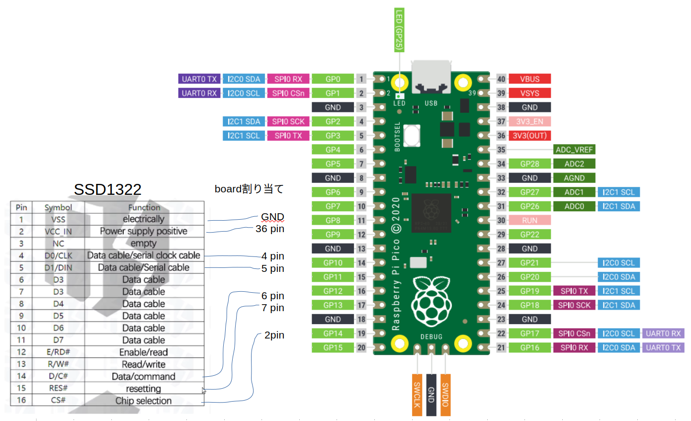

Raspberry Pi Pico (RP2040) を使って、SSD1322 OLEDディスプレイを制御するためのファームウェアリポジトリです。
SPI通信を利用して、グラフィック描画やアニメーション表示を実現します。

## ✨ 特徴

*   **SSD1322 OLEDディスプレイの初期化**: ディスプレイを最適な状態で使用するための初期設定を行います。
*   **基本的な描画機能**:
    *   ドット描画
    *   ライン描画
*   **サンプルアニメーション**:
    *   サイン波アニメーション
    *   ランダムドットアニメーション
*   **Raspberry Pi Pico SDK ベース**: Pico SDKの標準的な機能を利用しています。
*   **DMA転送対応**: DMAが勝手に転送するのでフレームバッファ1画面（256x64） 3741.00 usで転送できて早い！
*   **ポーリング転送対応**: ポーリングはフレームバッファ1画面送り終わるまでCPUがロックされるので遅い！

## 📺 液晶スペック
Driver chip:SSD1322  
interface: 6800,8080,3,4,lineSPI（サンプルコードでは4 SPI）  
Resolution: 256x64  
Display size : 3.12 inches  
16 levels grayscale  
voltage:3.3v  

## 🎬 デモ

動作の様子はこちらの動画でご覧いただけます。

## 🛠️ 必要なもの

*   Raspberry Pi Pico もしくは RP2040搭載ボード
*   SSD1322搭載 OLEDディスプレイモジュール (4ピンSPIインターフェース)

## 📌 ピン配置

## 📜 ライセンス
このプロジェクトは MIT license の下で公開されています。
